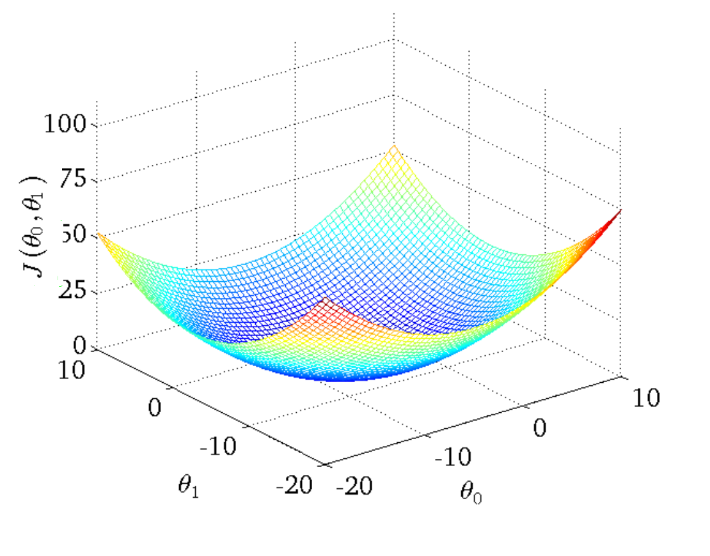

# Problem

imagine you have a dataset wich is (X,Y)
and you want an function wich can map X to Y

this library and algorithm will help you in this way to reach high accuracy...

let me tell more about usage in real world:

imagine we have Given data about the size of houses on the real estate market, we should predict the price by the size.

we spend time to collect data in city

and now we want a function wich fit in this data

our function should be like this:
h(size) = price
and it should be accurate

here is action we want to do:


and here is a sample data wich we collected:


now how we can reach to the best function?


# Solution


## 1 - Defining our function:
here we used gradient descent algorithm.
in this algorithm we define our function in this way:
m is count of memebers in X and y

m = lenght X and Y = |X| = |Y|


first we should choose a degree for our function equation
example: if you choose degree 1 your function will be like this:


## 2 - Choose a goal:
what should we do now?
in our function we need all θ values wich make the most accurate h(x) function

So we define collection that named weights in this way:


we need to find all θ values and use weights collection to build our function.


## 3 - Loss(Cost) Function
We can measure the accuracy of our hypothesis function(h) by using a cost function. This takes an average difference (actually a fancier version of an average) of all the results of the hypothesis with inputs from x's and the actual output y's.


we need to define a loss function.
loss function will calculate our errors.
we define our loss function that named J in this way:


we need weights wich points to minimum of J.
This function is otherwise called the "Squared error function", or "Mean squared error".


## 4 - Learning Algorithm

### PART A - Walk in plot

imagin our function is first-degree:


now we want to plot Loss(Cost) Function:


we use random numbers as θ values and it got here:


now we want to reach minimum value of J Function so we start to walk in this plot:


now let start our path from diffrent random loaction at start and walk to the minimum:


you can see we reach to diffrent minimums in J function wich they are local minimums.
in these algorithm if our h(x) is second degree or higher we may not reach the global minimum in J function.
our algorithm help us to reach local minimum.


### PART B - How to walk?

here we used gradient descent algorithm.
in this algorithm we update θ in this way:


if you cant understand this equation dont worry about that!

#### Sign :=

first about this symbol  :=

this symbol is used for defining

for example:

x = x + 1 

its mathematically wrong

but in maths we should act like this:

x := x + 1


#### Alpha

now let talk about alpha

alpha here is our learning rate

learning rate is my step size in our walk!

if alpha is too small, gradient descent can be slow.

if alpha is too large, gradient descent can overshoot the minimum. it may fail to converge, or even diverge.


#### Partial derivative

now let talk about this statement:


this statement is Partial derivative.
in this derivative we calculate derivative for multi-input functions.
in this derivative all other inputs are just simple constants and we look them like a simple numbers.

here you can read more!
https://www.mathsisfun.com/calculus/derivatives-partial.html


if we calculate this derivative we reach to this equation:


clearly our algorithm will be this:


**problem solved!**


#### now we want to know what is batch and batch_size?
we train {batch_size} count of labels from dataset in each epoch

0 < batch_size < m

## Advantages:
Fast and best algorithm for first-degree functions
(because in first-degree h(x) function, loss function J has only on minimum)



accurate models

## Disadvantages:
find local minimum in second-degree functions


# Library:
You can use this library to solve this kind of problems and reach to best weights...


here are examples and help you to use this library

import library
```python
import AI
```

build a model
```python
my_model = AI.model(degree = 1)
```

load weights
```python
my_model.load('weights.txt')
```

train model
```python
my_model.train(training_set = (X, Y),
               learning_rate = 10 ** -3,
               epochs = 10 ** 4 * 5
)
```

save model
```python
my_model.save('weights.txt')
```

if you need more information you can read AI.py
here is sample.py wich used this library to solve a question and it will help you too!


# &
Special Thanks to Andrew NG

some photos are from machine learning course wich has been teached by Andrew NG!)
